# Meleon Architecture & Technical Design

## Overview

Meleon is a schema-driven system for parsing ALTO and PageXML formats into PyArrow tables, optimized for batch processing with configurable memory usage. It provides bidirectional XML processing (parsing and serialization) with cross-library compatibility through Narwhals integration.

## System Architecture

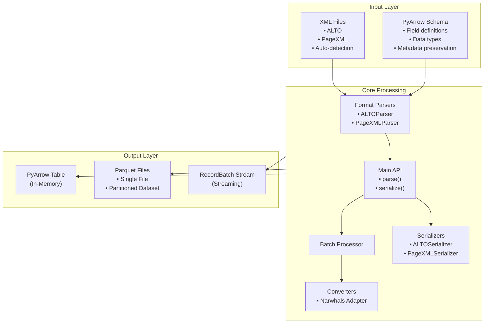

## Module Organization

```
src/meleon/
├── __init__.py              # Public API exports
├── main.py                  # Core parsing/serialization functions
├── batch.py                 # Batch processing with streaming support
├── config.py                # Pydantic configuration models
├── processors.py            # Streaming, parallel, and hybrid processors
├── cli.py                   # Typer CLI implementation
├── schemas.py               # PyArrow schema definitions (ALTO, PageXML, Metadata)
├── services.py              # Service layer for business logic
├── utils.py                 # Utility functions & helpers
├── parsers/                 # Parsing implementations
│   ├── __init__.py
│   ├── base.py             # Abstract base parser (BaseParser)
│   ├── base_xml.py         # Base XML parser with common utilities
│   ├── alto.py             # ALTO XML parser implementation
│   └── pagexml.py          # PageXML parser implementation
├── serializers/             # Serialization implementations
│   ├── __init__.py
│   ├── base.py             # Abstract base serializer (BaseSerializer)
│   ├── alto.py             # ALTO XML serializer
│   └── pagexml.py          # PageXML serializer
└── converters/              # Data transformation utilities
    ├── __init__.py
    └── narwhals_adapter.py  # Cross-library compatibility (Polars/Pandas/PyArrow)
```

## Component Architecture

### Parser and Serializer Hierarchy

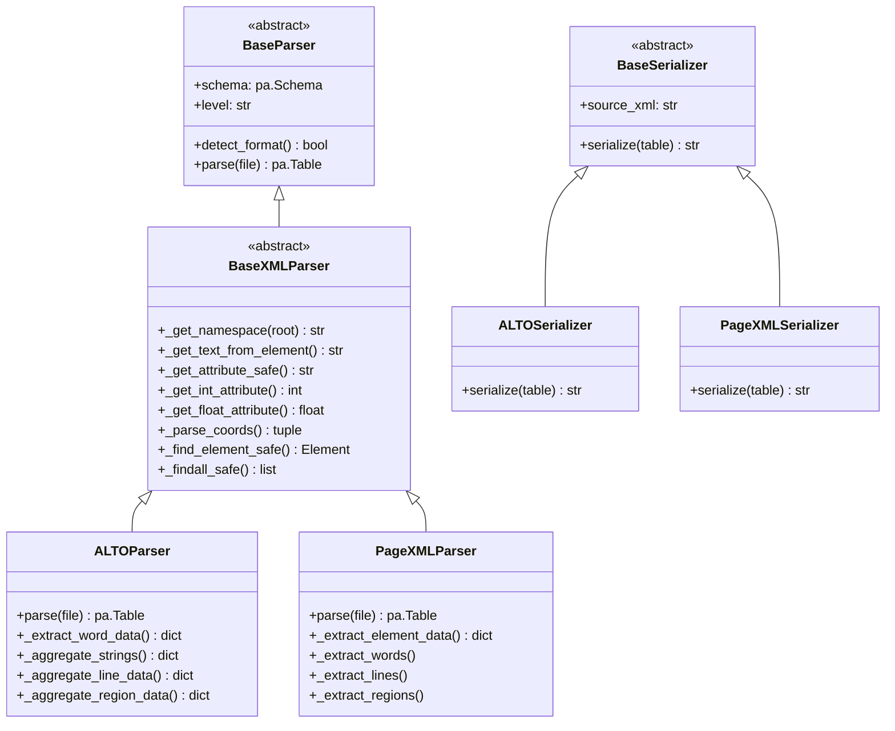

### Processing Components and Service Layer

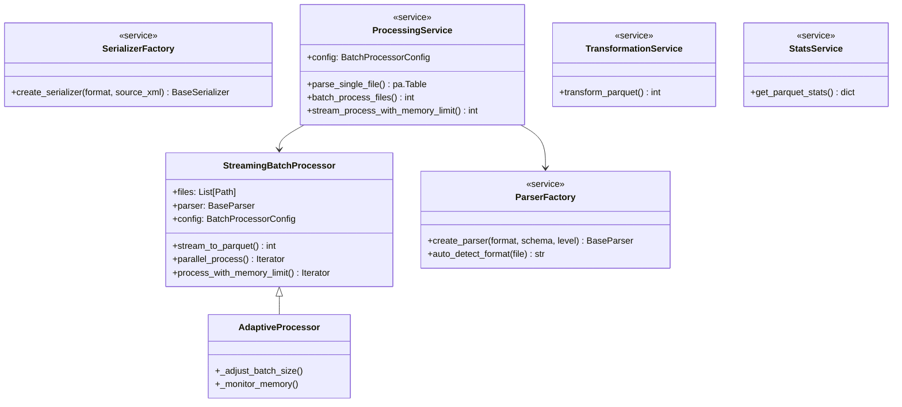

## Data Flow Architecture

### Single File Processing

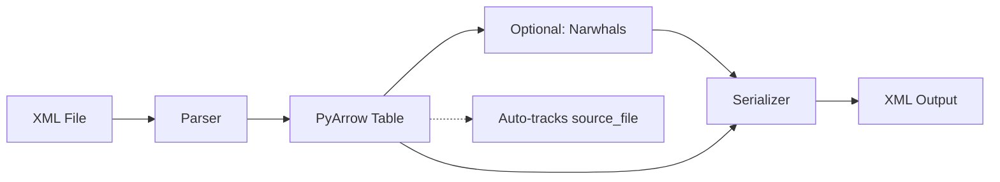

### Roundtrip Conversion Flow

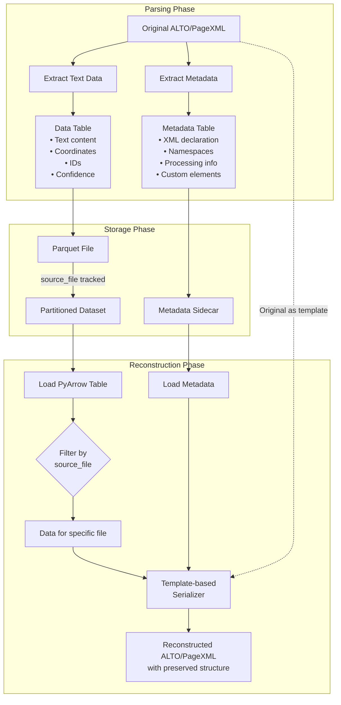

### Metadata Preservation Strategy

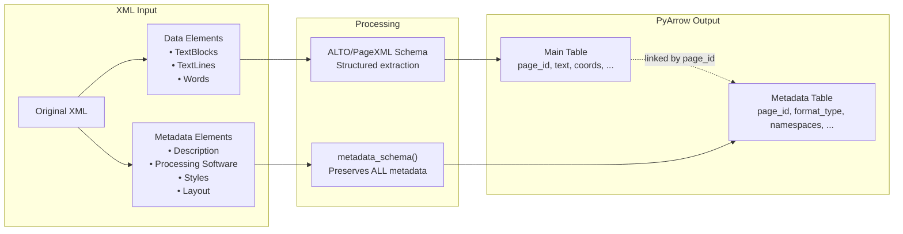

### Batch Processing Flow

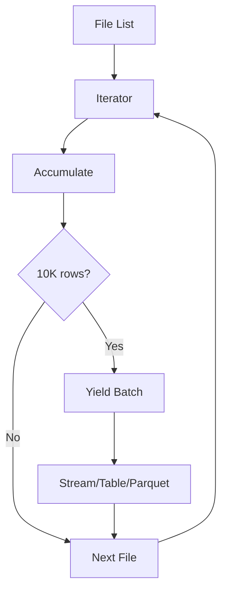

### Batch to Individual XML Reconstruction

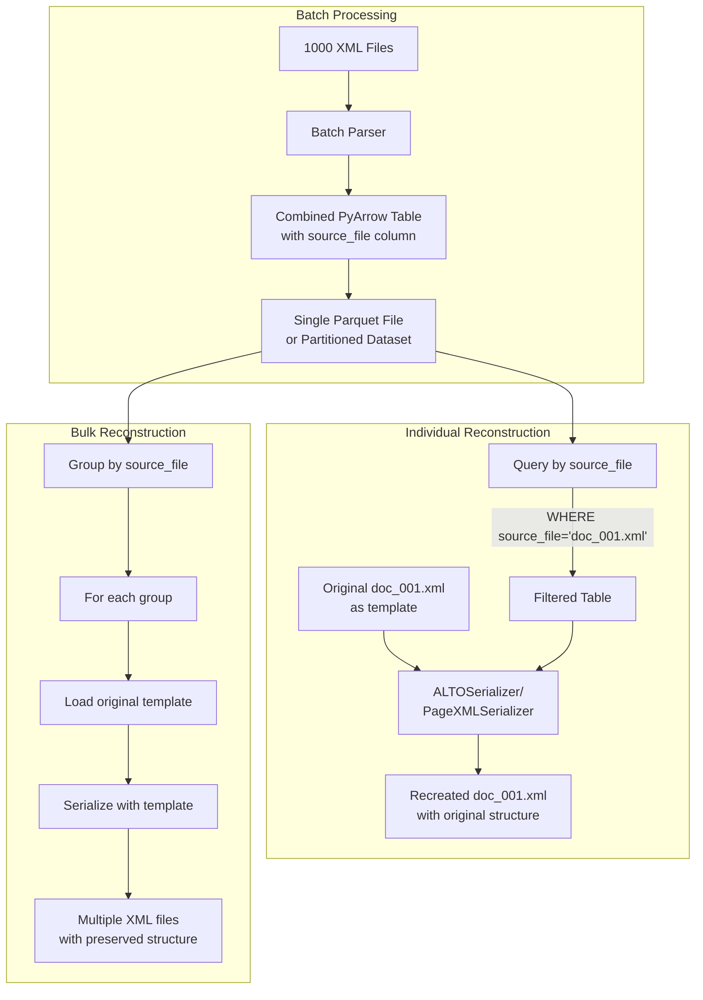

### Cross-Library Processing


## Memory Management Strategy

### Memory-Efficient Processing

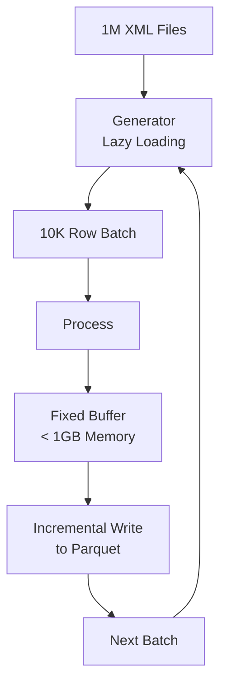

### Parallel Processing Architecture

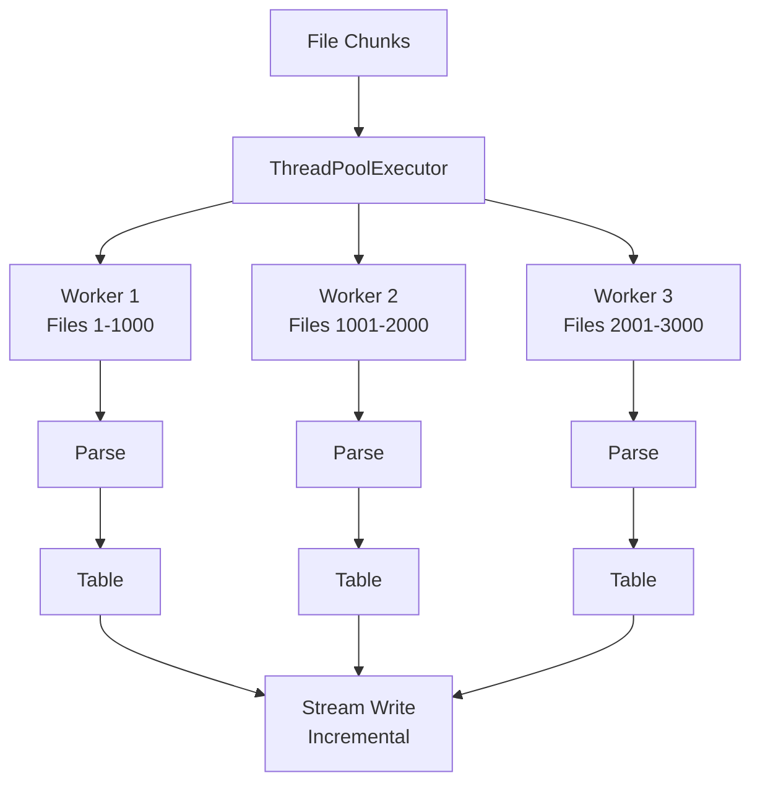

## Recent Refactoring Improvements

### Code Simplification (2024)

#### Before Refactoring
- PageXML parser: 338 lines with massive DRY violations
- ALTO parser: 289 lines with duplicated extraction logic
- Complex type hints throughout
- Unnecessary Pydantic models for internal data

#### After Refactoring
- PageXML parser: 245 lines (27.5% reduction)
- ALTO parser: 211 lines (27% reduction)
- BaseXMLParser: 176 lines of reusable utilities
- Removed unnecessary ExtractedText Pydantic model
- Simplified to use plain dictionaries
- Cleaner code without complex type hints

### Key Improvements

1. **DRY Principle Applied**
   - Single `_extract_element_data()` method replaces 4 duplicate blocks in PageXML
   - Common XML utilities extracted to `BaseXMLParser`
   - Aggregation logic unified in ALTO parser

2. **Service Layer Pattern**
   - `ParserFactory`: Dynamic parser creation with auto-detection
   - `ProcessingService`: Business logic separated from CLI
   - `TransformationService`: Data transformation operations
   - CLI now only handles user interaction

3. **Simplified Data Flow**
   - Direct dictionary usage instead of intermediate Pydantic models
   - PyArrow expects dicts anyway - no conversion needed
   - Cleaner, more maintainable code

## Schema Definitions

### PyArrow Schema Structure

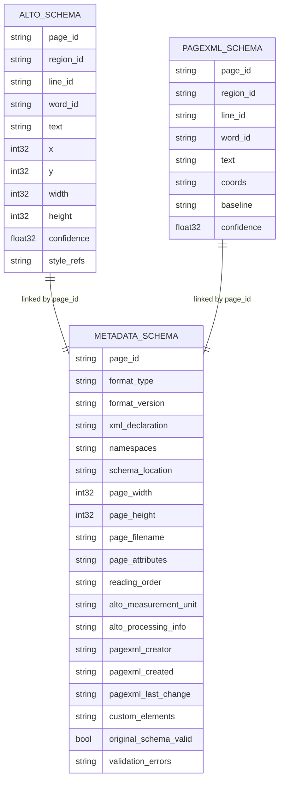

### Schema Usage in Roundtrip

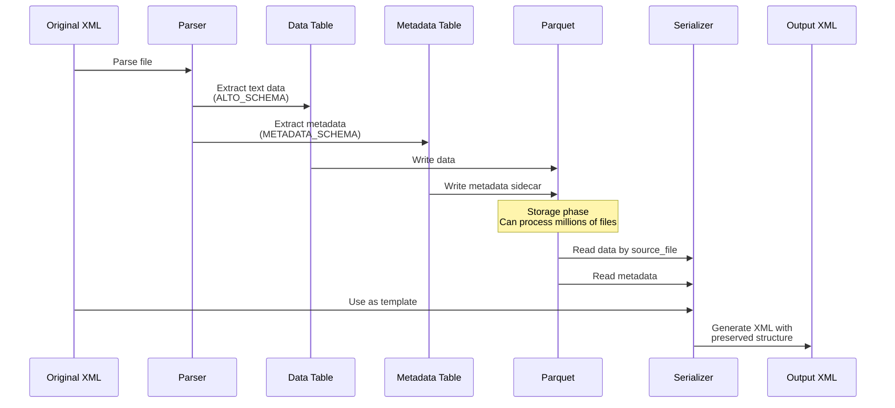

## API Design

### Main API Functions (main.py)

```python
# Core parsing with dependency injection
def parse(file_path: str, parser: BaseParser) -> pa.Table:
    """Parse XML file using configured parser instance"""

# Template-based serialization
def serialize(data_table: pa.Table, serializer: BaseSerializer) -> str:
    """Serialize PyArrow table back to XML using template"""

# Convenience functions with auto-detection
def parse_alto(file_path: str, level: str = "word") -> pa.Table
def parse_pagexml(file_path: str, level: str = "word") -> pa.Table
```

### Batch Processing API (batch.py)

```python
# Memory-efficient batch processing with streaming
def batch_process(files, parser, output_path=None, batch_size=10000,
                 streaming=True, config=None):
    """Process files with streaming or batch mode"""

# Parquet I/O with PyArrow integration
def read_parquet_batches(path, batch_size, columns, filters):
    """Read Parquet with column projection and filter pushdown"""
```

### Streaming Processors API (processors.py)

```python
class StreamingBatchProcessor:
    """Memory-efficient streaming batch processor"""
    def stream_to_parquet(output_path) -> int
    def parallel_process() -> Iterator[RecordBatch]
    def process_with_memory_limit() -> Iterator[Table]
    def stream_transform_serialize(transformer, serializer, output_dir) -> int
    def to_lazy_dataset(output_path) -> Dataset

class HybridProcessor(StreamingBatchProcessor):
    """Hybrid processor combining parallel and streaming"""
    def process() -> Iterator[RecordBatch]

class AdaptiveProcessor(HybridProcessor):
    """Processor that adapts to system resources"""
```

### Configuration API (config.py)

```python
class ProcessingConfig(BaseModel):
    batch_file_size: int  # Files to process in parallel
    batch_row_size: int   # Rows per batch
    shard_size: int       # Rows per Parquet shard
    max_workers: int      # Parallel workers
    processing_mode: Literal["sequential", "parallel", "streaming", "hybrid"]

class BatchProcessorConfig(BaseModel):
    processing: ProcessingConfig
    streaming: StreamingConfig
    parquet: ParquetConfig
    dataset: DatasetConfig
```

### Cross-Library Support (converters/narwhals_adapter.py)

```python
# Narwhals integration for dataframe interoperability
def to_narwhals(table: pa.Table) -> nw.DataFrame
def from_narwhals(df: nw.DataFrame) -> pa.Table
def transform(table: pa.Table, func: Callable) -> pa.Table
```

## Processing Modes

### Streaming Mode
- Memory usage: O(batch_size)
- Use case: Large file collections
- Incremental writing to Parquet

### Parallel Mode
- Memory usage: O(workers * batch_size)
- Use case: Medium datasets with CPU resources
- ThreadPoolExecutor-based processing

### Hybrid Mode
- Combines parallel and streaming
- Adapts batch size to available memory

### Adaptive Mode
- Automatically adjusts to system resources
- Monitors memory usage and adjusts batch sizes


## Key Design Decisions

| Decision | Rationale |
|----------|----------|
| **PyArrow as core data structure** | • Native Parquet support<br/>• Zero-copy operations<br/>• C++ performance |
| **Schema-driven extraction** | • Type safety<br/>• Selective field extraction<br/>• Predictable output |
| **Template-based serialization** | • Preserves document metadata<br/>• Maintains XML structure<br/>• Simpler implementation |
| **Narwhals integration** | • Cross-library compatibility<br/>• User choice of dataframe lib<br/>• Future-proof design |
| **Batch by rows, not files** | • Consistent memory usage<br/>• Handles varying file sizes<br/>• Predictable performance |
| **10K row default batch size** | • Balance memory vs I/O<br/>• Optimized for typical workloads<br/>• User configurable |
| **Dependency injection** | • Clear separation of concerns<br/>• Testable components<br/>• Flexible configuration |

## Error Handling Strategy

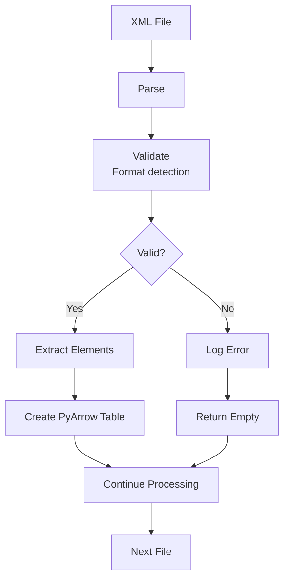

### Batch Processing Error Resilience

- Individual file failures don't stop batch processing
- Failed files are logged with detailed error messages
- Empty batches are handled gracefully
- Partial results are preserved and written
- Configurable error thresholds and retry logic

## Scalability Architecture

### Vertical Scaling

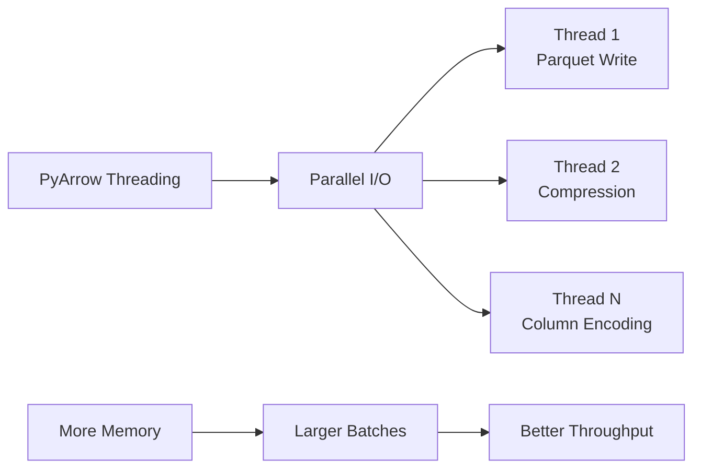

### Horizontal Scaling

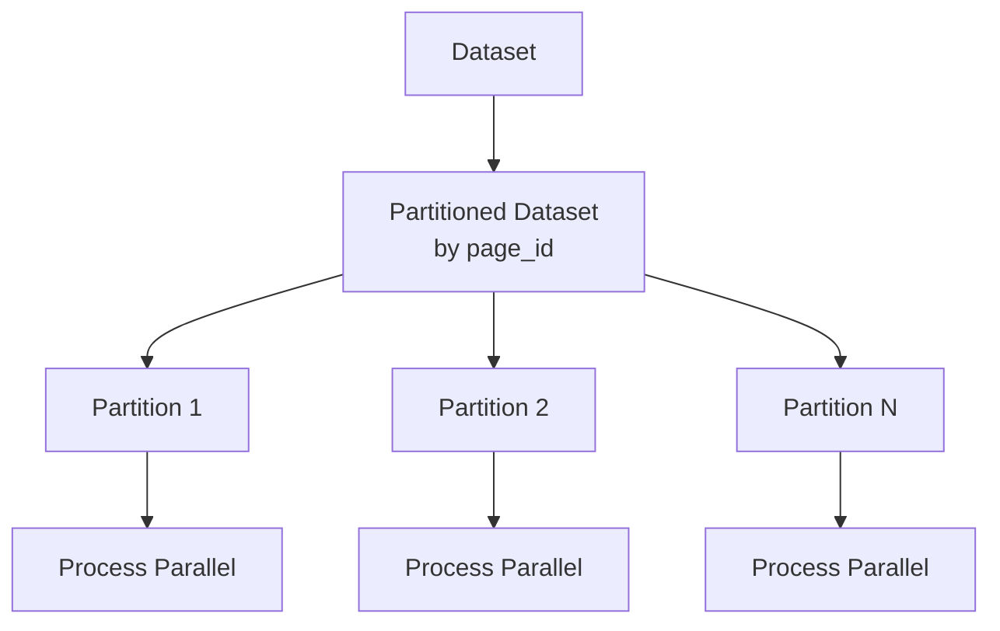

### Storage Optimization

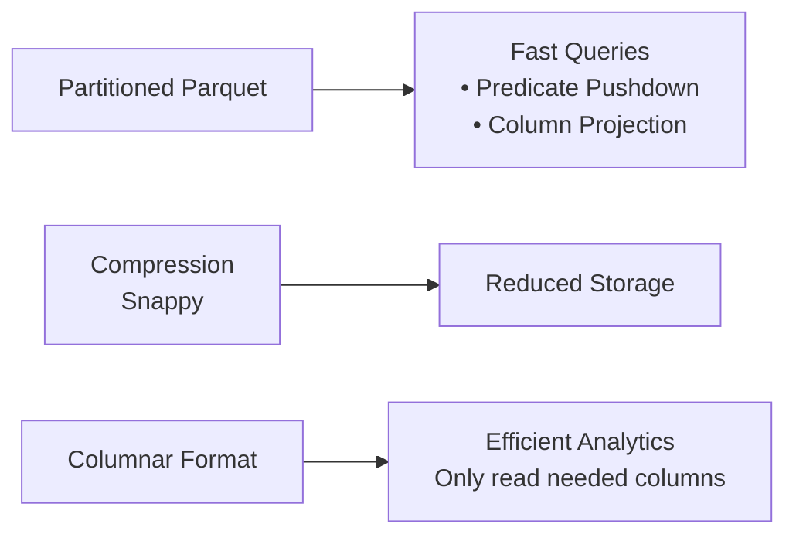

## API Usage Examples

### Using the Service Layer (Recommended)

```python
# New simplified approach with service layer
from meleon.services import ProcessingService, ParserFactory

# Auto-detect format and process
service = ProcessingService()
table = service.parse_single_file(
    input_file="document.xml",
    format_type="auto",  # Auto-detects ALTO or PageXML
    level="word"
)

# Batch process with filtering
files = ["file1.xml", "file2.xml", "file3.xml"]
total_rows = service.batch_process_files(
    files=files,
    output_path="output.parquet",
    format_type="auto",
    level="word",
    mode="streaming"
)
```

### Basic Roundtrip Example

```python
# 1. Parse ALTO to PyArrow
from meleon import parse, serialize, ALTOParser, ALTOSerializer
from meleon.schemas import ALTO_SCHEMA

parser = ALTOParser(ALTO_SCHEMA, level="word")
table = parse("original.xml", parser)

# 2. Process/transform the data
import pyarrow.compute as pc
filtered = table.filter(pc.field("confidence") > 0.9)

# 3. Serialize back to ALTO using original as template
serializer = ALTOSerializer(source_xml="original.xml")
xml_output = serialize(filtered, serializer)

# xml_output preserves all original metadata and structure
```

### Batch Processing with Reconstruction

```python
# 1. Batch process many files to Parquet
from meleon import batch_process, ALTOParser
from meleon.schemas import ALTO_SCHEMA
import glob

files = glob.glob("xmls/*.xml")
parser = ALTOParser(ALTO_SCHEMA, level="word")

batch_process(
    files,
    parser,
    output_path="combined.parquet",
    streaming=True
)

# 2. Later: Reconstruct specific file from Parquet
import pyarrow.parquet as pq
import pyarrow.compute as pc
from meleon import serialize, ALTOSerializer

# Load and filter by source file
table = pq.read_table("combined.parquet")
file_data = table.filter(
    pc.field("source_file") == "xmls/document_001.xml"
)

# Serialize using original as template
serializer = ALTOSerializer(source_xml="xmls/document_001.xml")
reconstructed_xml = serialize(file_data, serializer)
```

### Metadata Preservation Example

```python
# 1. Simple parsing
from meleon import parse, ALTOParser
from meleon.schemas import ALTO_SCHEMA, metadata_schema

parser = ALTOParser(ALTO_SCHEMA, level="word")
table = parse("document.xml", parser)

# 2. Batch processing with streaming
from meleon import batch_process

batch_process(
    files,
    parser,
    output_path="output.parquet",
    batch_size=10000,
    streaming=True
)

# 3. Cross-library processing with Narwhals
from meleon.converters.narwhals_adapter import NarwhalsAdapter

adapter = NarwhalsAdapter()
df = adapter.to_narwhals(arrow_table)
# Transform with Polars/Pandas...
result = adapter.from_narwhals(df)

# 4. Serialization with template
from meleon import serialize, ALTOSerializer

serializer = ALTOSerializer(source_xml="original.xml")
xml_output = serialize(modified_table, serializer)

# 5. Streaming with memory limit
from meleon import StreamingBatchProcessor, BatchProcessorConfig

config = BatchProcessorConfig()
config.processing.memory_limit_mb = 512

processor = StreamingBatchProcessor(files, parser, config)
processor.stream_to_parquet("output_dir/")

# 6. Lazy dataset operations
import pyarrow.dataset as ds
import pyarrow.compute as pc

dataset = ds.dataset("output_dir/", format="parquet")
scanner = dataset.scanner(
    columns=["text", "confidence"],
    filter=pc.field("confidence") > 0.9
)
for batch in scanner.to_batches():
    # Process filtered batches
    pass
```


## Configuration System

```python
class BatchProcessorConfig:
    processing: ProcessingConfig
    streaming: StreamingConfig
    parquet: ParquetConfig
    dataset: DatasetConfig

class ProcessingConfig:
    batch_file_size: int = 1000
    batch_row_size: int = 10000
    shard_size: int = 100000
    max_workers: Optional[int] = None
    memory_limit_mb: int = 1024
    processing_mode: Literal["sequential", "parallel", "streaming", "hybrid"]
    compression: str = "snappy"
```

## Roundtrip Capabilities Summary

### Supported Workflows

1. **Single File Roundtrip**
   - XML → PyArrow → Transform → XML (preserves structure)

2. **Batch Processing with Individual Reconstruction**
   - 1000s of XMLs → Single Parquet → Query by source_file → Individual XMLs

3. **Metadata Preservation**
   - All non-text elements preserved in metadata table
   - Linked to data via page_id
   - Used during serialization to reconstruct original structure

4. **Template-Based Serialization**
   - Original XML serves as template
   - Data is injected into template preserving all formatting
   - Ensures perfect roundtrip fidelity

### Tested Pipeline Capabilities

Successfully tested complete pipeline for:
1. **Loading multiple ALTO XML files**
2. **Data transformation** (filter by confidence > 0.95)
3. **Serialization to both ALTO and PageXML formats**

Example test results:
- Input: 2 ALTO files, 16 total words
- Filter: WC > 0.95
- Output: 10 high-confidence words (62.5%)
- Generated both filtered ALTO and PageXML outputs

### Current Limitations
- Template required for XML serialization (by design - ensures structure preservation)
- Limited to ALTO and PageXML formats
- No XSD schema validation
- Basic error reporting in batch mode

### Extension Points
- Add new format support by extending BaseParser/BaseSerializer
- Custom schemas through PyArrow schema definitions
- Cloud storage support via PyArrow dataset API
- Custom processors by extending StreamingBatchProcessor
